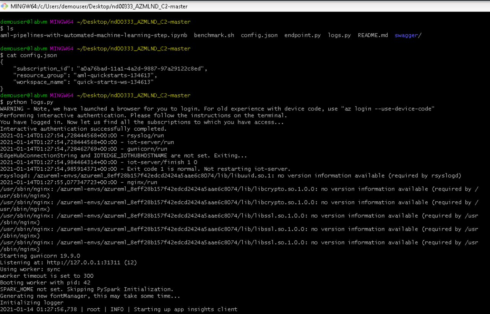
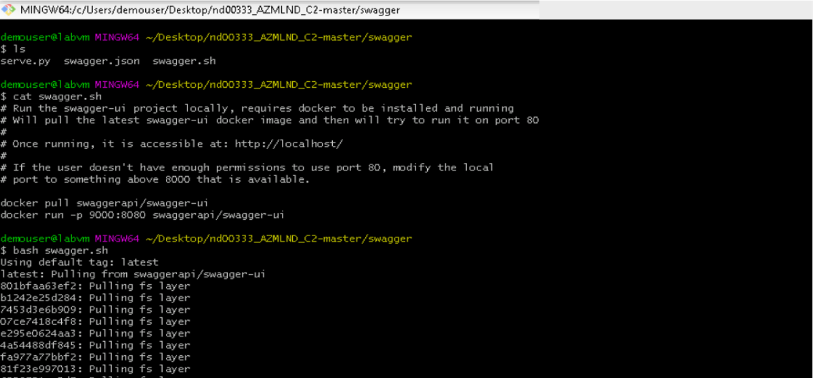
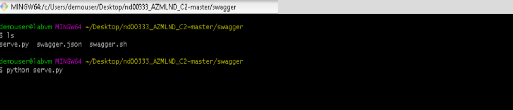
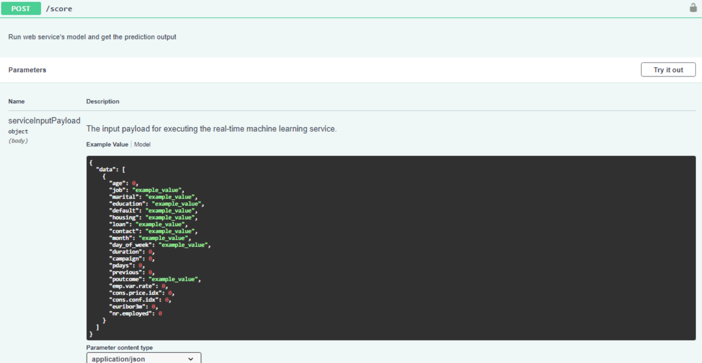
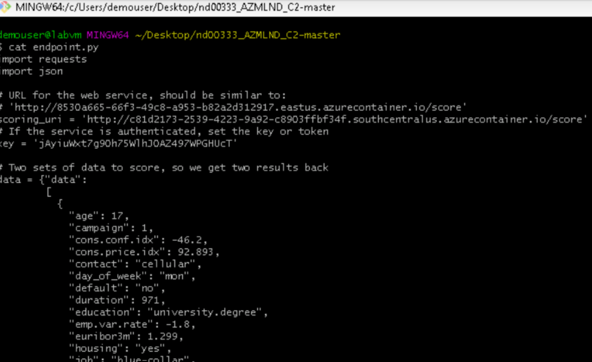

# Operationalizing-Machine-Learning

## Overview
This project is done as a part of Udacity's 'Machine Learning Engineer with Microsoft Azure' nanodegree course and we were given an opportunity to configure a cloud-based machine learning production model, deploy it, and consume it on Azure. Also, a Machine Learning Pipeline has been created, published, and consumed using Python SDK.

## Architectural diagram

## Dataset
The project uses [Bank marketing dataset](http://archive.ics.uci.edu/ml/datasets/Bank+Marketing). It is related with direct marketing campaigns (phone calls) of a Portuguese banking institution and has the following attributes:
- **Input variables:** age, job, marital, education, default, housing, loan, contact, month, day_of_week, duration, campaign, pdays, previous, poutcome, emp.var.rate, cons.price.idx, cons.conf.idx, euribor3m, nr.employed
- **Output variable:** y

The classification goal is to predict if the client will subscribe a term deposit (variable y (binary: 'yes','no')).

 

## Project description
**1. Enable Security and Authentication:** Authentication is crucial for the continuous flow of operations. When authentication is not set properly, it requires human interaction and thus, the flow is interrupted. Hence, it's good to use authentication with automation whenever possible. Since the role assignments permission (which is required for creating Service Principals) has been disabled for the lab access I have, this step is not included in the project.

**2. Automated ML experiment:** AutoML is the process of automating the process of applying machine learning to real-world problems. During training, AML creates a number of pipelines in parallel that try different algorithms and parameters for you. The service iterates through ML algorithms paired with feature selections, where each iteration produces a model with a training score.

Voting Ensemble was selected as the optimal model by the AutoML run. It is an ensemble machine learning model that combines the predictions from multiple other models (Eg, LightGBM, Random forest etc:-). It is a technique that may be used to improve model performance, ideally achieving better performance than any single model used in the ensemble.

**3. Deploy the best model:** Deployment is about delivering a trained model into production so that it can be consumed by others. In Azure, deploying the best model will allow it to interact with the HTTP API service and interact with the model by sending data over POST requests. In this project, I have deployed the model into a production environment using Azure Container Instance (ACI). ACI offers the fastest and simplest way to run a container without having to manage any virtual machines and without having to adopt a higher-level service. Also, authentication is enabled to prevent unauthorized access.

**4. Enable logging:** Application Insights is a very useful tool to detect anomalies and visualize performance. Though it can be enabled before deployment, here we have used Python SDK to enable it after deploying the best model. After downloading [config.json](Files/config.json) from ML studio, python file [logs.py](Files/logs.py) is executed to enable logging. 

**5. Swagger Documentation:** Swagger is a tool that helps build, document, and consume RESTful web services. It further explains what types of HTTP requests API can consume (POST and GET). Azure provides a [swagger.json](Files/Swagger/swagger.json) that is used to create a web site that documents the HTTP endpoint for a deployed model. In [swagger.sh](Files/Swagger/swagger.sh) swagger UI container is made available on port 9000. Running [serve.py](Files/Swagger/serve.py) is crucial to consumed the contents of swagger.json locally. Also it is used to prevent CORS (Cross Origin Resource Sharing). By default, this script will run and serve contents on localhost:8000. 

**6. Consume deployed service:** In AML, we can consume a deployed service via an HTTP API. An HTTP API is a URL that is exposed over the network so that interaction with a trained model can happen via HTTP requests. Users can initiate an input request, usually via an HTTP POST request (HTTP POST is a request method that is used to submit data). The APIs exposed by Azure ML will use JSON to accept data and submit responses and serve as a bridge language among different environments. Use [endpoint.py](Files/endpoint.py) script to interact with the trained model. This process will generate [data.json](Files/data.json)

**7. Benchmarking the endpoint:** A benchmark is used to create a baseline or acceptable performance measure. Benchmarking HTTP APIs is used to find the average response time for a deployed model. One of the most significant metrics is the response time since Azure will timeout if the response times are longer than sixty seconds. Apache Benchmark is an easy and popular tool for benchmarking HTTP services. Execute [benchmark.sh](Files/benchmark.sh) to perform this process. 

**8. Pipeline Automation:** An Azure Machine Learning pipeline is an independently executable workflow of a complete machine learning task. Subtasks are encapsulated as a series of steps within the pipeline. A great way to automate workflows is via Pipelines and thus it can be executed using [Pipelines.ipynb](Files/Pipeline.ipynb) script. Here, we have created, published and consumed the Machine learning pipeline. 

## Screencast:

Refer this [recording](https://drive.google.com/file/d/1Rk0RDdDzcnGk56rUKuPeuEfNJ_WDdY2t/view?usp=sharing) for more details regarding the implementation.

## Future improvements: 
- Make changes while training the the models using AutoML(For example, Include deep learning models or increase the time for exit criterion while training and see if it will give a better accuracy). Deploy the model only after being sure that the best model obtained is actually the "best". 
- Manually clean the dataset before performing AutoML run and pipeline creation. 
- The accuracy of the model can be improved by solving the class imbalance issue of the bank-marketing datatset. 
- Visualize the results of 'Enable security and authentication' step by using an Azure account having all the services. 

## References: 
- [Microsoft Documentations](https://docs.microsoft.com/en-us/documentation/)
- [Udacity course contents- Machine learning engineer for Microsoft Azure](https://www.udacity.com/course/machine-learning-engineer-for-microsoft-azure-nanodegree--nd00333)
